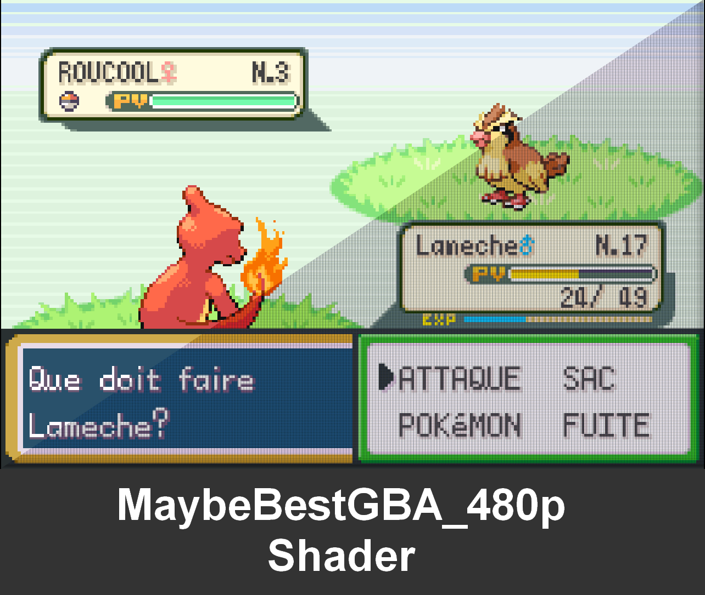

# `MaybeBestGBA_480p` shader (according to me)

- See the difference between the original and the custom shader [here](https://www.textcompare.org/image/?id=666b5862b90aa84d72987bc1).

# Screenshots:
### Aspect ratio, nearest, 640x424: 
- Bad text rendering, pixels are not even.

### Pixelate shader, 640x424:
- Too blurry and bad text rendering.

### Quilez shader, 640x424 :
- Too blurry too and bad text rendering.

### Pixelate shader + overlay, 640x424:

### Quilez shader + overlay, 640x424:

### MaybeBestGBA_480p shader + overlay, 640x424:
- Check the text rendering of the "A" letter, not even

### MaybeBestGBA_480p shader + overlay, 642x428:
- Check the text rendering of the "A" letter and the "U". It's even. Thanks to the resolution 642.

- But the "F" letter is not even. So you should play with the width and height.

### MaybeBestGBA_480p shader + overlay, real picture:

